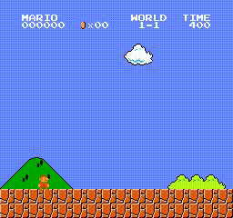

# SuperMario_DeepQlearning

I use Deep Q-Learning to train a RL agent to learn to play 1985 Nintendo game Super Mario Bros. The agent learns control policies from raw pixel data using deep reinforcement learning, meaning the only input to the agent is the screenshot of the game, as with what would be the case with a human player. The OpenAI Gym was used to simulate the environment and its interactions with the agent.

